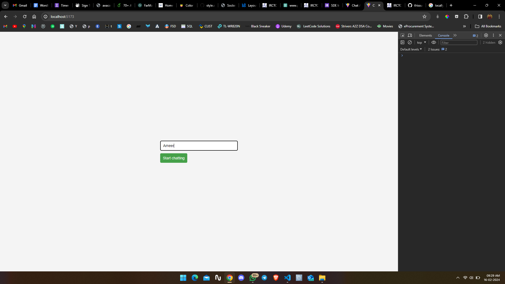
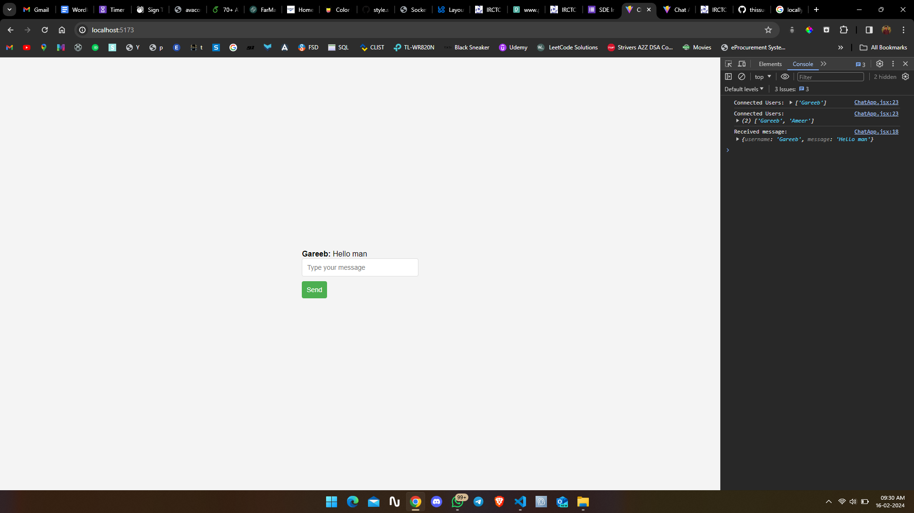
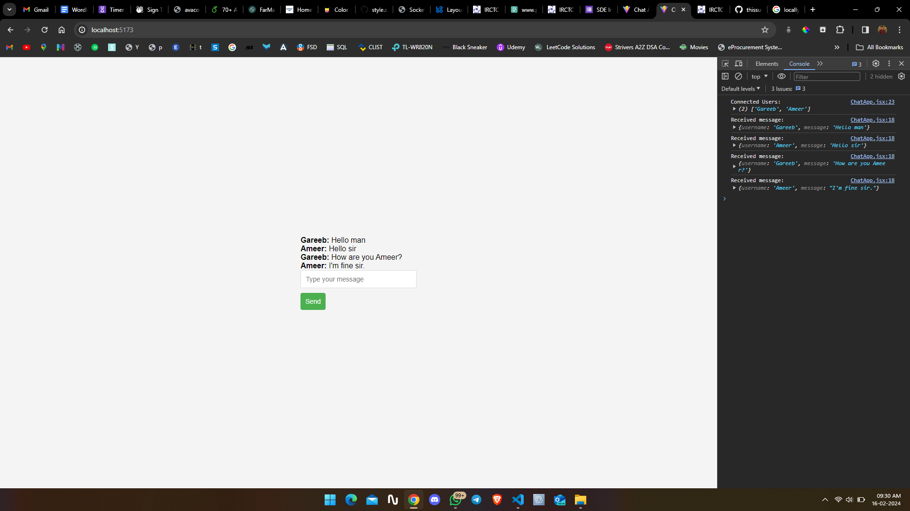
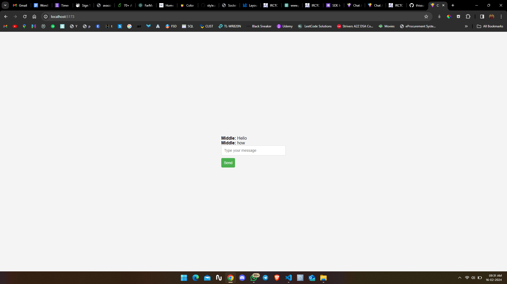
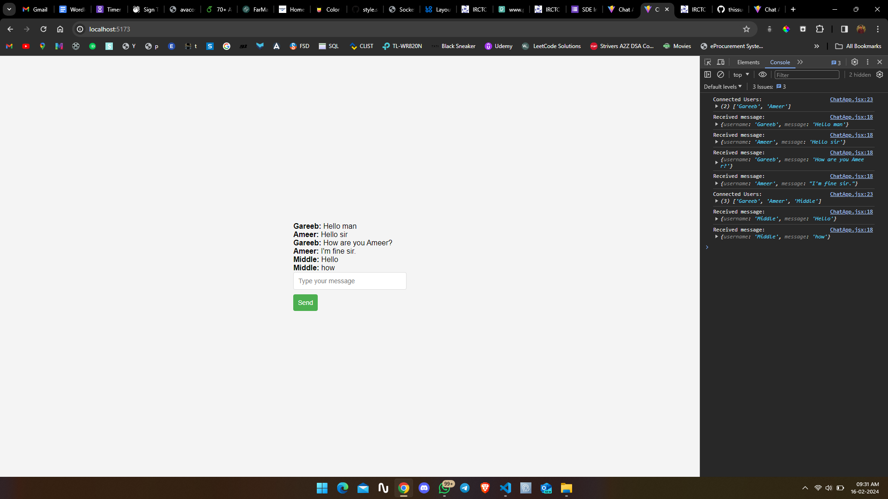

# React + Vite

This template provides a minimal setup to get React working in Vite with HMR and some ESLint rules.

Currently, two official plugins are available:

- [@vitejs/plugin-react](https://github.com/vitejs/vite-plugin-react/blob/main/packages/plugin-react/README.md) uses [Babel](https://babeljs.io/) for Fast Refresh
- [@vitejs/plugin-react-swc](https://github.com/vitejs/vite-plugin-react-swc) uses [SWC](https://swc.rs/) for Fast Refresh

To run the project locally you can use `npm` or `yarn`:
"npm install or yarn add"

Here is exapmle image:

I have use io.emit which is broadcasting all the meassage from the user across the tabs, also when username is add it create a random Id for all the users in the array. Then it render all the users frontend. After reloading the page the users will be disconnected automatically.

Here is deployed link: https://chat-room-1l9qzlotc-thissudhir.vercel.app/
